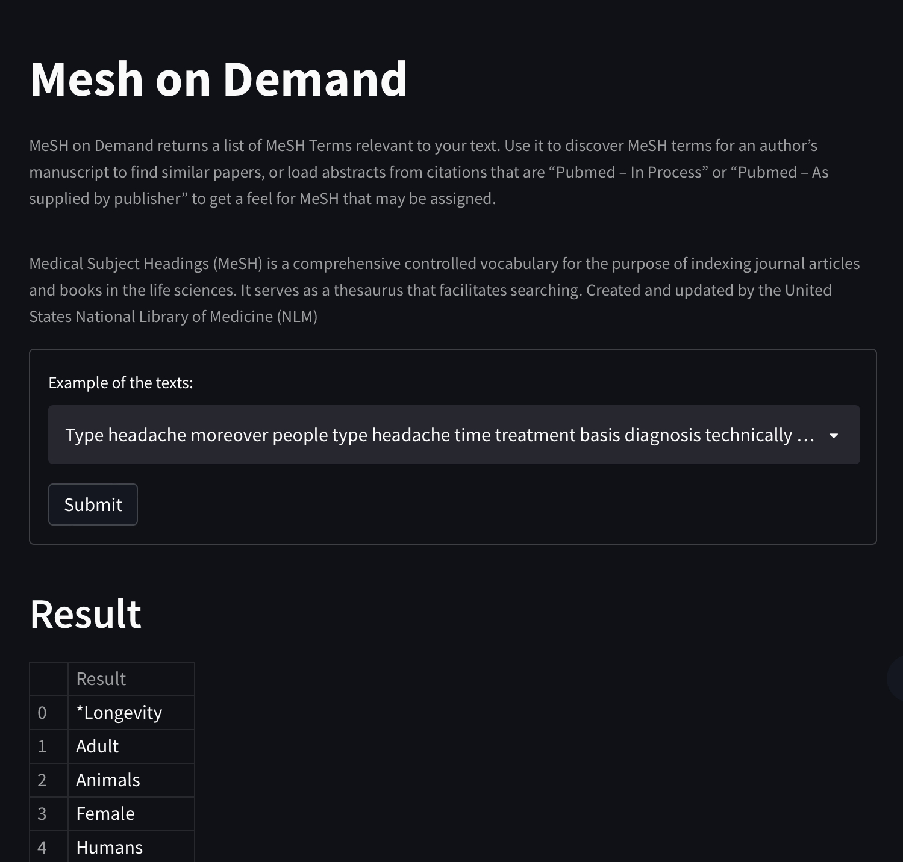

# Mesh On Demand Recreation

This is the the repository of mesh on demand recreation using LSTM model. MeSH on Demand returns a list of MeSH Terms relevant to your text. Use it to discover MeSH terms for an author’s manuscript to find similar papers, or load abstracts from citations that are “Pubmed – In Process” or “Pubmed – As supplied by publisher” to get a feel for MeSH that may be assigned.

# W2
 1. Create the github repo

# W3
 1. Store a dataset
 2. Explain the dataset
     1. The dataset contains the diabetes melitus subject heading which contains the part of speech tagging of the data fetch from the Mesh on Demand website. 1. 
 3. Preprocessing;

# W4 
 1. Data preprocessing

# W5

 1. Exploratory data analysis; Visualizatin
 2. Creating the regression Model 

# W6
 1. Creating the regression model; playing with parameter;

# W7
 1. Creating the regression model
 2. Creating the LSTM Model; playing with parameter;

# W8
 1. Creating the LSTM Model; playing with parameter;
 2. Creating the clustering using KKN method; It works; 

# W9

 1. Add evaluation metrics using shilouette score 

# W10
 1. Add save file and website development using streamlit

# W11
 1.  Add website using streamlit with python

# W16 - UAS 
UAS ANSWER IN THE END
https://github.com/nurrizkyimani/mesh_on_demand/blob/master/Data_Mining_Nurrizky.ipynb
